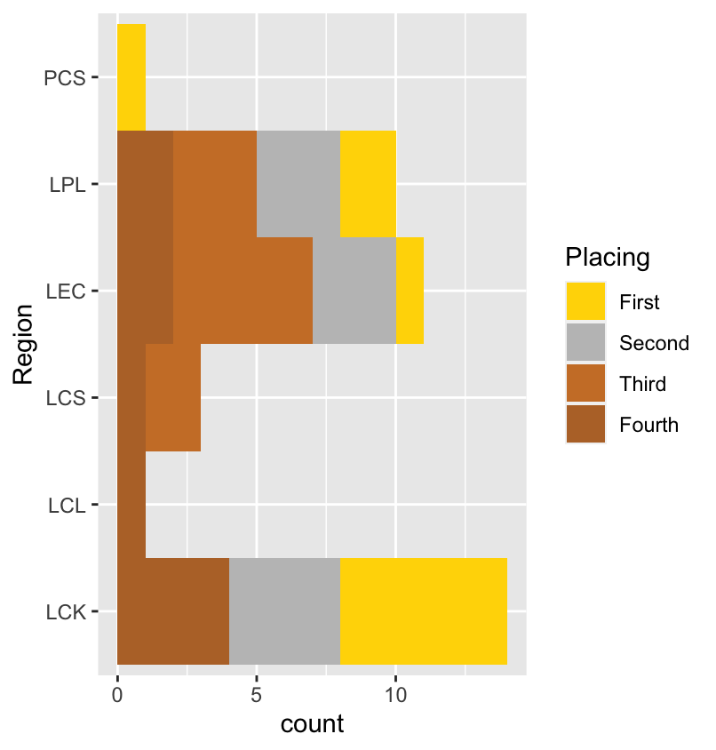

##### Name:
Wonjoon Cho

##### Date :
11 Dec 2020

# Dominating Rift Between American and Korean League of Legends Teams

### Introduction

Ever since the introduction of video games from classics like Atari and Nintendo Entertainment System a new culture has emerged that along with the technology, evolves throughout the years. Gaming has become an increasingly more popular form of entertainment all around the world. Like any recreational form of sports, a competitive scene blossomed to the scene. Games like StarCraft, League of Legends, Super Smash Bros, Counter Strike, and etc, have become a growing market in the business of eSports. While Counter Strike and Super Smash Bros have seen success in the United States, games like StarCraft and League of Legends started to thrive in South Korea. For this project I will take an inside look with the game of League of Legends to compare the success and growth in the United States and South Korea.

Gaming culture in the United States is much different than the gaming culture in South Korea. There are many reasons as to why that would be the case, but some key reasons could be the success in gaming Korea has accomplished compared to the United States and the extracurricular activities students in America are more familiar with.

### Skill Gap

The four main regions in League of Legends are South Korea, China, Europe, and North America. Eastern regions usually out perform western regions by a large margin. South Korea has had a history of being a dominating region when it came to League of Legends. Besides the first season, South Korea has placed top 4 in every World Championship, and won 6 out of the 10 seasons. This bar chart shows what each region accomplished in the League of Legends World Championship from 2011-2020. **Note: PCS (Pacific Championship Series) = South-East Asia, LPL (League of Legends Pro League)= China, LEC (League of Legends European Championship)= Europe, LCS (League Championship Series) = North America, LCL (League of Legends Continental League)= Russia, LCK (League of Legends Champions Korea)= South Korea**



LCK teams had nearly five times more placements than the LCS teams. In fact, LCS teams have never placed higher than third place. Furthermore, whenever an LCS team played against an LCK team in international scene, it was clear to see who were the favorites. These matches are gathered from Intel Extreme Masters (IEC), Mid-Season Invitational(MSI), and LoL World Championship(LWC) from years 2014-2017.


### The Mess That is North America

It has become a part of a meme culture that North American teams seem to look promising during their regular season, as they compete against themselves, only to perform horrendously in the World Championship. Strangely enough during the Mid Season Invitational, North American teams have won against international teams through challenging match ups. However, when it came to World Championships near the end of the year, it is laughable how poor they perform.

Prior to LoL World Championships is the LCS Summer Split Playoffs that determines the top three teams that will compete at Worlds. Coming into the Spring Split, Cloud 9 had an impressing 17-1 record and went on to win the Spring Split Playoffs making their total record to be 26-2. They looked very promising to be a Worlds Champion contender. In the beginning of the Summer Split they will go on winning 9 games in a row before losing their first game, bringing their record to an impressive 35-2. They would finish the Summer Split with a record of 13-5 becoming second seed of the Summer Playoffs.

The Summer Playoffs was definitely a strange and messy tournament. The seeding goes as the following Team Liquid (TL), Cloud 9 (C9), FlyQuest (FLY), Team Solo Mid (TSM), Golden Guardians (GG), and Evil Geniuses (EG). In Round 1, FLY defeats EG (3,2) and TSM gets swept by GG (0,3). Round 2 TL defeats GG (3,0), and C9 Loses to FLY (1,3). This advances TL and FLY to the Semi-finals. In the losers' bracket, TSM redeems themselves and barely defeats GG (3,2), and C9 sweeps EG (3,0). The most anticipated matchup that was supposed to happen in round 2 was TSM vs C9. There was a fierce rivalry between these two teams, however through unfavored odds, TSM defeats C9. Back to the winners bracket TL loses to FLY (2,3). TSM defeats TL (3,2), then finally TSM become Summer Split Champions defeating FLY (3,2) to complete their miracle run.

This set up for 2020 World Championship which had left North American fans embarrassed about being American. In Group stages there are four groups with four teams in each group. The top two teams of each group make it to Playoffs and whichever team had a better group record attains a better seeding placement in the Playoffs. Team Liquid representing our third placed LCS team placed first in the Play-in stage, and barely lost in the group stage by an unfortunate circumstance where they were the only team to lose to Machi eSports (PCS) which gave them a losing record. Fly Quest, the second placed LCS team, played much better than people had expected. Their group contained of two power house teams DRX (LCK) and Top Esports (LPL). Fly Quest, in an unbelievable fashion, defeated the World's favorite, Top Esports. Finally, Team Solo Mid, our most hyped team to make it to Playoffs had a tough but winnable group. They had Gen G (3rd LCK), Fnatic (2nd LEC), and LGD Gaming (4th LPL). In the half of the group stage they had a depressing start of an 0-3 record. When the second half was played, there was a glimpse of hope for 30 until they lost their fourth game, then the fifth game, and then the sixth game. This display of defeat showed the disparity of LCS teams compared to LEC, LCK, and LPL.

So the obvious question is why is South Korean teams out performing North American teams? Firstly, there is a sheer difference when it comes to amount of players in America (2.2m) and Korea (4.8m). These numbers don't show the amount of players in the game, but only the ones that is ranked.


With a higher player base, it allows there to be a more competitive scene in the higher ranks. In League of Legends, a person with an account level of at least 30 is qualified to play ranked games. They must play at least 20 games to be most likely placed between Iron and Gold Tier. Afterwards, they can play ranked games to gain League Points(LP) to rank up. In higher ranking, like Masters, Grandmasters, and Challenger, things become more challenging. After Diamond 1, you must gain a certain amount of LP to join the Master tier. From there, the top 10 players of Masters are promoted to Grandmasters and the bottom 10 players of Grandmasters are demoted to Masters once every two weeks. The same concept goes for Challenger. In Korea and America there can only be 300 players in Challenger, and 700 people in Grandmasters. Since Korea more than doubles the amount of players than America, it can be assumed that the competition is much better for the Eastern country.


### Culture

Another reason as to why Koreans are better performing is the booming market of PC cafes. In Korea, on nearly every corner, there is a PC cafe (or PC Bangs) that are cafes with high end gaming computers and high speed internet. The pricing is very cheap around a dollar for an hour, and this allowed gaming to be a very popular form of entertainment. Most students would go to their nearest PC cafe after their school.

A key difference between America and Korea that also widen's the skill gap are Universities. In America it is common to go to school for athletics while studying a certain study. In Korea if a student were wanting to play a sport for their school, they usually go into the study of that sport and either become pro or a coach, or trainer. So this discouraged students to train competitively and instead played video games.

### eSports

However, in the states a new form of sports are becoming a popular form of recruitment and scholarship. eSports is growing at an increasing rate to which introduces more players and makes gaming more accepting into the society. The market shows a trend that closely resembles the NBA at a smaller scale.


This increase in market is largely due to the rising audience in the eSports competitions. This graph shows a comparison of the Super Bowl, League of Legends Worlds Championship Finals, and the US Open Finals.


Here we can take a closer look at the LoL WC Finals with a linear regression model.


This is the summary output:

```
Residuals:
    Min      1Q  Median      3Q     Max
-13.955  -8.117  -1.955   6.375  18.504

Coefficients:
              Estimate Std. Error t value Pr(>|t|)    
(Intercept) -24276.776   2406.162  -10.09 7.94e-06 ***
Year            12.070      1.194   10.11 7.82e-06 ***
---
Signif. codes:  0 ‘***’ 0.001 ‘**’ 0.01 ‘*’ 0.05 ‘.’ 0.1 ‘ ’ 1

Residual standard error: 10.84 on 8 degrees of freedom
Multiple R-squared:  0.9274,	Adjusted R-squared:  0.9183
F-statistic: 102.2 on 1 and 8 DF,  p-value: 7.819e-06
```

### Final Thoughts

It is clear to see a trend. While the Super Bowl had a similar trend in the beginning of their existence, it had plateaued at around 150 million viewers. Since it has only been 10 years, it is hard to say how much more League of Legends will grow. It is safe to say that each year LoL has been growing, and is becoming more popular around the world. However, video games tend to follow a trend of fast growth and a simmering disappearance. Take Dota 2 and Super Smash Bros Melee, these two games have dominated in viewership and prize pool for a short time, and now nearly have gone into irrelevance. While League of Legends continue to grow, it is unknown whether America will ever out perform Korea.


### References:

Nassiri, T. (2019, February 14). Implications of eSports Proliferation in Korea and North America. Retrieved December 10, 2020, from https://tylernassiri.wordpress.com/2017/12/30/implications-of-esports-proliferation-in-korea-and-north-america/

Margaret C. Keiper, R. Douglas Manning, Seth Jenny, Tracy Olrich & Chris Croft (2017) No reason to LoL at LoL: the addition of esports to intercollegiate athletic departments, Journal for the Study of Sports and Athletes in Education, 11:2, 143-160, DOI: 10.1080/19357397.2017.1316001

Hallmann, K., & Giel, T. (2018). ESports – Competitive sports or recreational activity? Sport Management Review, 21(1), 14-20. doi:10.1016/j.smr.2017.07.011

Huhh, J. (2008). Culture and Business of PC Bangs in Korea. Games and Culture, 3(1), 26-37. doi:10.1177/1555412007309525

Howard, Matthew Jungsuk. “ESPORT: PROFESSIONAL LEAGUE OF LEGENDS AS CULTURAL HISTORY.” University of Houston, 2018.

Data collected from Wikipedia, Kaggle, Newzoo, and Statistica

