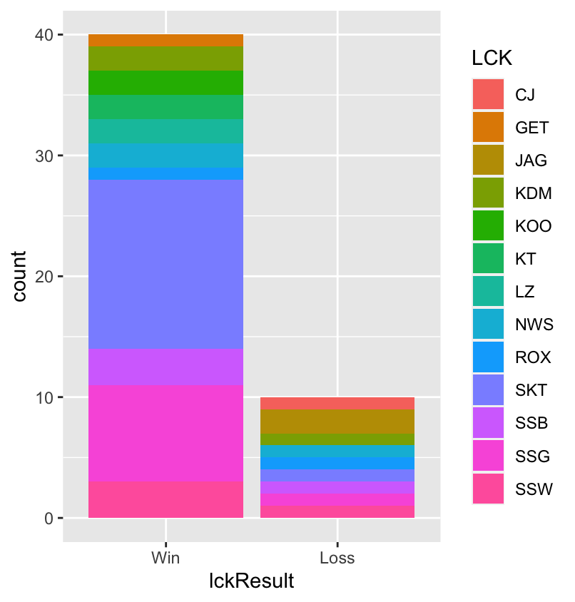
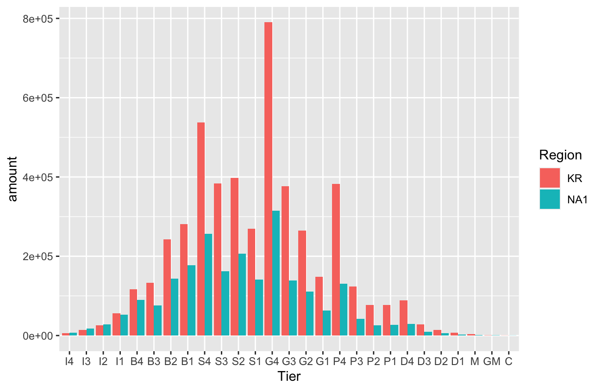
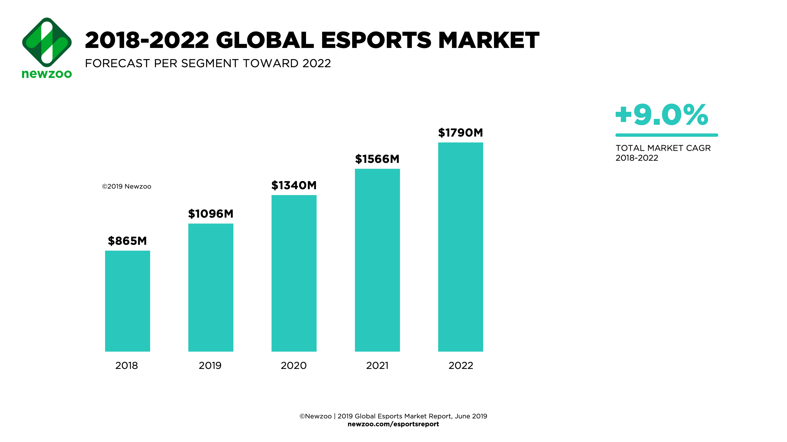
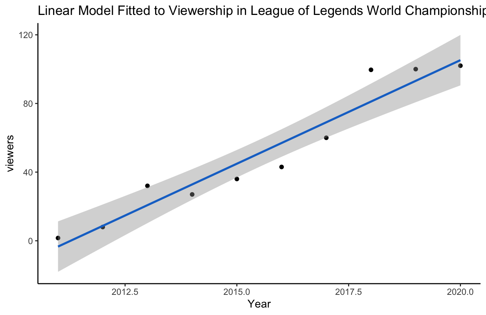

##### Name(s) :
Wonjoon Cho

##### Date :
20 Nov 2020

##### Title :
Inside look of the Gaming Culture in the United States and South Korea

### Introduction

Ever since the introduction of video games from classics like Atari and Nintendo Entertainment System a new culture has emerged that along with the technology, evolves throughout the years. Gaming has become an increasingly more popular form of entertainment all around the world. Like any recreational form of sports, a competitive scene blossomed to the scene. Games like StarCraft, League of Legends, Super Smash Bros, Counter Strike, and etc, have become a growing market in the business of eSports. While Counter Strike and Super Smash Bros have seen success in the United States, games like StarCraft and League of Legends started to thrive in South Korea. For this project I will take an inside look with the game of League of Legends to compare the success and growth in the United States and South Korea.

Gaming culture in the United States is much different than the gaming culture in South Korea. There are many reasons as to why that would be the case, but some key reasons could be the success in gaming Korea has accomplished compared to the United States and the extracurricular activities students in America are more familiar with.

###Skill Gap

South Korea has had a history of being a dominating region when it came to League of Legends. Besides the first season, South Korea has placed top 4 in every World Championship, and won 6 out of the 10 seasons. This bar chart shows what each region accomplished in the League of Legends World Championship from 2011-2020. **Note: PCS = South-East Asia, LPL = China, LEC = Europe, LCS = North America, LCL = Russia, LCK = South Korea**


LCK teams had nearly five times more placements than the LCS teams, and LCS teams have never placed higher than third place. Furthermore, whenever an LCS team played against an LCK team in international competition, it was clear to see who were the favorites. These matches are gathered from Intel Extreme Masters (IEC), Mid-Season Invitational(MSI), and LoL World Championship(LWC) from years 2014-2017.




So the obvious question is why is South Korean teams out performing North American teams? Firstly, there is a sheer difference when it comes to amount of players in America (2.2m) and Korea (4.8m). These numbers don't show the amount of players in the game, but only the ones that is ranked.



With a higher player base, it allows there to be a more competitive scene in the higher ranks. In League of Legends, a person with an account level of at least 30 is qualified to play ranked games. They must play at least 20 games to be most likely placed between Iron and Gold Tier. Afterwards, they can play ranked games to gain League Points(LP) to rank up. In higher ranking, like Masters, Grandmasters, and Challenger, things become more challenging. After Diamond 1, you must gain a certain amount of LP to join the Master tier. From there, the top 10 players of Masters are promoted to Grandmasters and the bottom 10 players of Grandmasters are demoted to Masters once every two weeks. The same concept goes for Challenger. In Korea and America there can only be 300 players in Challenger, and 700 people in Grandmasters. Since Korea more than doubles the amount of players than America, it can be assumed that the competition is much better for the Eastern country.


###Culture

Another reason as to why Koreans are better performing is the booming market of PC cafes. In Korea, on nearly every corner, there is a PC cafe (or PC Bangs) that are cafes with high end gaming computers and high speed internet. The pricing is very cheap around a dollar for an hour, and this allowed gaming to be a very popular form of entertainment. Most students would go to their nearest PC cafe after their school.

A key difference between America and Korea that also widen's the skill gap are Universities. In America it is common to go to school for athletics while studying a certain study. In Korea if a student were wanting to play a sport for their school, they usually go into the study of that sport and either become pro or a coach, or trainer. So this discouraged students to train competitively and instead played video games.

###eSports

However, in the states a new form of sports are becoming a popular form of recruitment and scholarship. eSports is growing at an increasing rate to which introduces more players and makes gaming more accepting into the society. The market shows a trend that closely resembles the NBA at a smaller scale.




This increase in market is largely due to the rising audience in the eSports competitions. This graph shows a comparison of the Super Bowl, League of Legends Worlds Championship Finals, and the US Open Finals.


Here we can take a closer look at the LoL WC Finals with a linear regression model.



This is the summary output:

```
Residuals:
    Min      1Q  Median      3Q     Max
-13.955  -8.117  -1.955   6.375  18.504

Coefficients:
              Estimate Std. Error t value Pr(>|t|)    
(Intercept) -24276.776   2406.162  -10.09 7.94e-06 ***
Year            12.070      1.194   10.11 7.82e-06 ***
---
Signif. codes:  0 ‘***’ 0.001 ‘**’ 0.01 ‘*’ 0.05 ‘.’ 0.1 ‘ ’ 1

Residual standard error: 10.84 on 8 degrees of freedom
Multiple R-squared:  0.9274,	Adjusted R-squared:  0.9183
F-statistic: 102.2 on 1 and 8 DF,  p-value: 7.819e-06
```

###Final Thoughts

It is clear to see a trend. While the Super Bowl had a similar trend in the beginning of their existence, it had plateaued at around 150 million viewers. Since it has only been 10 years, it is hard to say how much more League of Legends will grow. It is safe to say that each year LoL has been growing, and is becoming more popular around the world. However, video games tend to follow a trend of fast growth and a simmering disappearance. Take Dota 2 and Super Smash Bros Melee, these two games have dominated in viewership and prize pool for a short time, and now nearly have gone into irrelevance. While League of Legends continue to grow, it is unknown whether America will ever out perform Korea.


###References:

Nassiri, T. (2019, February 14). Implications of eSports Proliferation in Korea and North America. Retrieved December 10, 2020, from https://tylernassiri.wordpress.com/2017/12/30/implications-of-esports-proliferation-in-korea-and-north-america/

Margaret C. Keiper, R. Douglas Manning, Seth Jenny, Tracy Olrich & Chris Croft (2017) No reason to LoL at LoL: the addition of esports to intercollegiate athletic departments, Journal for the Study of Sports and Athletes in Education, 11:2, 143-160, DOI: 10.1080/19357397.2017.1316001

Hallmann, K., & Giel, T. (2018). ESports – Competitive sports or recreational activity? Sport Management Review, 21(1), 14-20. doi:10.1016/j.smr.2017.07.011

Huhh, J. (2008). Culture and Business of PC Bangs in Korea. Games and Culture, 3(1), 26-37. doi:10.1177/1555412007309525

Howard, Matthew Jungsuk. “ESPORT: PROFESSIONAL LEAGUE OF LEGENDS AS CULTURAL HISTORY.” University of Houston, 2018.


(Did you remember to add your name(s) to the top of this document?)
